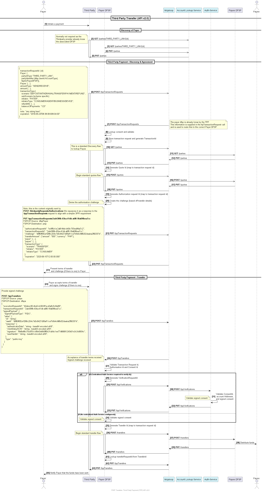
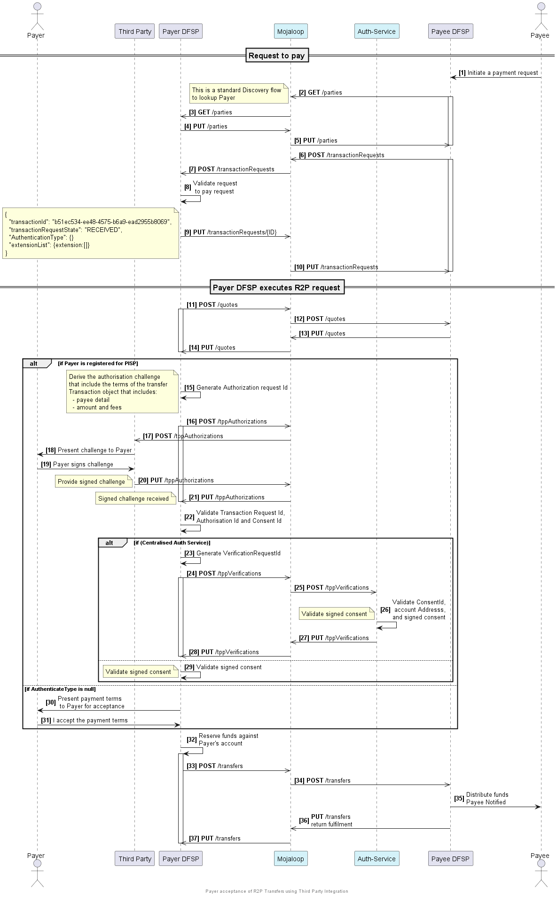
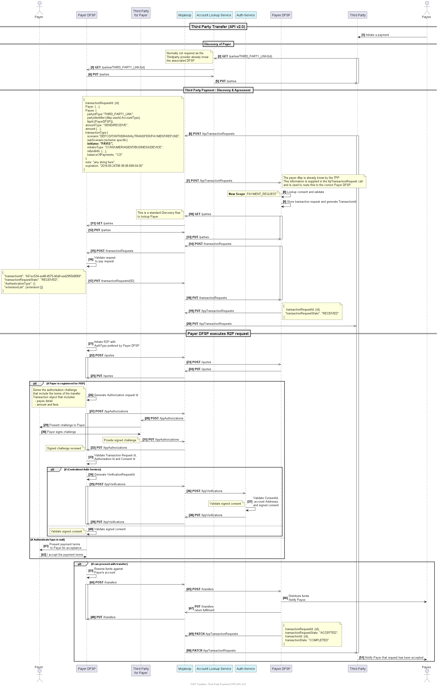
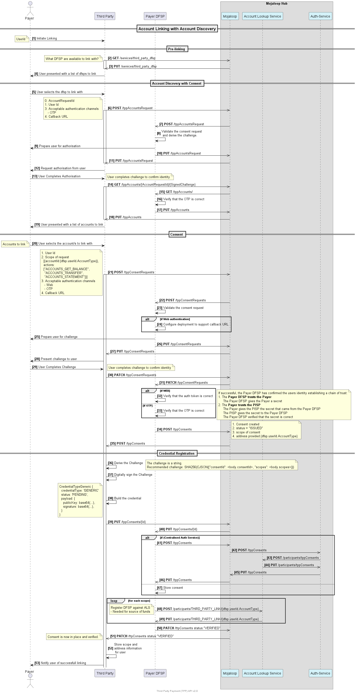

# PISP API v2.xx

## Payer Initiated use case
### PISP Transfer

## Payee Initiated use case
### Payer PISP acceptance of conditions 
When a Payer DFSP receives a request to pay for a Payer and that has their account linked to a PISP provider, the DFSP may choose to use the PISP authorization flow to get authorization from the user for the payment.

### PISP request to pay
Here the PISP has linked their account with a scope that permits the sending of a request to pay request to their DFSP. The Payee DFSP receives this request, validates, and then initiates a request to pay for payment into their linked account. This sequence diagram build on the previous diagram.

## Account linking
Account linking require three stages of authorizing.
1. Permission to release account information to PISP
1. Permission to link account with defined scope
1. Configuration of the credential to be used to authorize payment.

